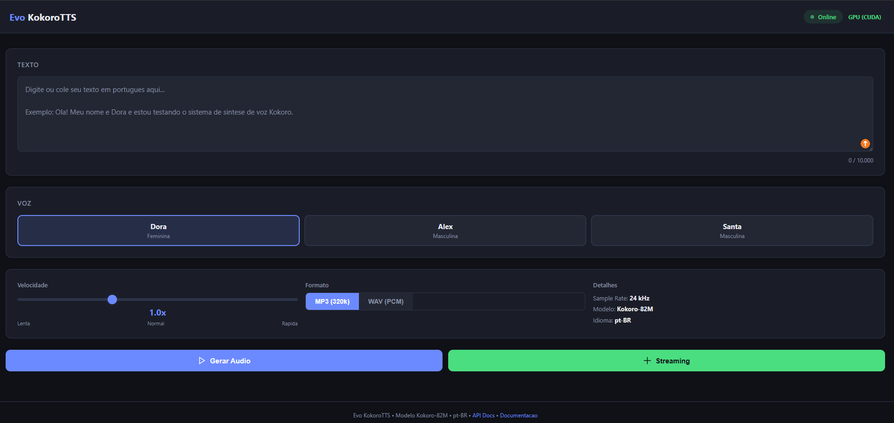
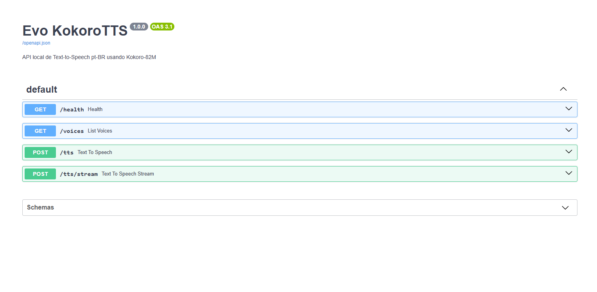
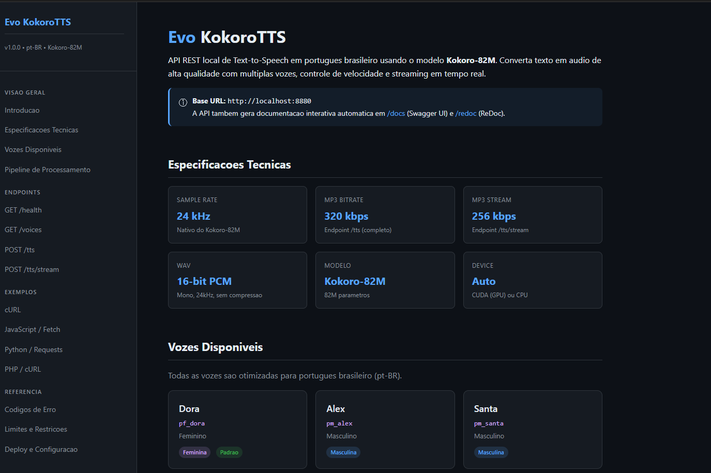

# Evo KokoroTTS

API local de **Text-to-Speech em Portugues Brasileiro** usando o modelo **Kokoro-82M**.

Converta texto em audio de alta qualidade com multiplas vozes, controle de velocidade e streaming em tempo real. Interface web inclusa, sem necessidade de conhecimento tecnico.



---

## Recursos

- **3 vozes pt-BR** - Dora (feminina), Alex e Santa (masculinas)
- **Interface web** - Abre automaticamente no navegador, pronta para usar
- **API REST** completa com documentacao Swagger interativa
- **Streaming em tempo real** - Receba o audio enquanto esta sendo gerado
- **Deteccao automatica GPU/CPU** - Usa placa de video NVIDIA se disponivel
- **Instalacao one-click** - Um unico `install.bat` instala tudo
- **Formatos MP3 e WAV** - MP3 a 320kbps ou WAV 16-bit PCM
- **Otimizado para pt-BR** - Pre-processamento de acentos, abreviacoes, moedas, ordinais

---

## Instalacao

### Requisitos

- **Windows 10/11** (64-bit)
- **espeak-ng** - Baixe e instale de: https://github.com/espeak-ng/espeak-ng/releases
  - Baixe o arquivo `.msi`, instale e marque a opcao de adicionar ao PATH

> Python, ffmpeg e PyTorch sao instalados automaticamente pelo instalador.

### Passo a passo

```
1. Baixe ou clone o repositorio
   git clone https://github.com/marksjr/Evo_kokoroTTS.git

2. Instale o espeak-ng (link acima)

3. Execute o instalador (duplo-clique)
   install.bat

4. Inicie o servidor (duplo-clique)
   run-kokoro.bat
```

O instalador detecta automaticamente:
- Se voce tem **Python** instalado (senao, baixa Python Embedded automaticamente)
- Se voce tem **ffmpeg** (senao, baixa automaticamente)
- Se voce tem **GPU NVIDIA** (instala PyTorch CUDA) ou **apenas CPU** (instala versao leve)

Apos iniciar com `run-kokoro.bat`, a interface web abre automaticamente no navegador.

---

## Interface Web

Acesse `http://localhost:8880` apos iniciar o servidor.


| Funcao | Descricao |
|--------|-----------|
| **Texto** | Digite ou cole ate 10.000 caracteres |
| **Voz** | Escolha entre Dora, Alex ou Santa |
| **Velocidade** | De 0.5x (lenta) a 2.0x (rapida) |
| **Formato** | MP3 (320kbps) ou WAV (PCM 16-bit) |
| **Gerar Audio** | Gera o audio completo e reproduz |
| **Streaming** | Gera e envia em tempo real |
| **Download** | Baixa o arquivo gerado como `audio.mp3` ou `audio.wav` |

O status no canto superior direito mostra:
- **Online / Offline** - Se a API esta rodando
- **GPU (CUDA)** ou **CPU** - Qual hardware esta sendo usado

---

## API REST

Documentacao interativa disponivel em `http://localhost:8880/docs` (Swagger UI).



### Endpoints

| Metodo | Rota | Descricao |
|--------|------|-----------|
| `GET` | `/health` | Status da API (online, device, modelo) |
| `GET` | `/voices` | Lista vozes disponiveis |
| `POST` | `/tts` | Gera audio completo (MP3 ou WAV) |
| `POST` | `/tts/stream` | Streaming de audio em tempo real |

### POST /tts - Gerar audio

```json
{
  "text": "Ola! Meu nome e Dora.",
  "voice": "pf_dora",
  "speed": 1.0,
  "format": "mp3"
}
```

| Campo | Tipo | Obrigatorio | Padrao | Descricao |
|-------|------|:-----------:|--------|-----------|
| `text` | string | **Sim** | - | Texto para sintetizar (1 a 10.000 caracteres) |
| `voice` | string | Nao | `pf_dora` | `pf_dora`, `pm_alex` ou `pm_santa` |
| `speed` | float | Nao | `1.0` | Velocidade: `0.5` (lenta) a `2.0` (rapida) |
| `format` | string | Nao | `mp3` | `mp3` (320kbps) ou `wav` (PCM 16-bit) |

### POST /tts/stream - Streaming

```json
{
  "text": "Texto longo para streaming em tempo real.",
  "voice": "pm_alex",
  "speed": 1.2
}
```

| Campo | Tipo | Obrigatorio | Padrao | Descricao |
|-------|------|:-----------:|--------|-----------|
| `text` | string | **Sim** | - | Texto para sintetizar (1 a 10.000 caracteres) |
| `voice` | string | Nao | `pf_dora` | `pf_dora`, `pm_alex` ou `pm_santa` |
| `speed` | float | Nao | `1.0` | Velocidade: `0.5` a `2.0` |

Resposta: streaming MP3 a 256kbps (chunked transfer).

---

## Exemplos de uso via cURL

```bash
# Verificar status
curl http://localhost:8880/health

# Gerar MP3 (minimo)
curl -X POST http://localhost:8880/tts \
  -H "Content-Type: application/json" \
  -d '{"text":"Ola, mundo!"}' \
  --output audio.mp3

# Gerar com voz masculina, velocidade 1.2x
curl -X POST http://localhost:8880/tts \
  -H "Content-Type: application/json" \
  -d '{"text":"Testando a API.","voice":"pm_alex","speed":1.2}' \
  --output audio.mp3

# Gerar WAV
curl -X POST http://localhost:8880/tts \
  -H "Content-Type: application/json" \
  -d '{"text":"Audio sem compressao.","format":"wav"}' \
  --output audio.wav

# Streaming
curl -X POST http://localhost:8880/tts/stream \
  -H "Content-Type: application/json" \
  -d '{"text":"Streaming em tempo real."}' \
  --output stream.mp3
```

---

## Vozes disponiveis

| ID | Nome | Genero | Descricao |
|----|------|--------|-----------|
| `pf_dora` | Dora | Feminino | Voz feminina brasileira (padrao) |
| `pm_alex` | Alex | Masculino | Voz masculina brasileira |
| `pm_santa` | Santa | Masculino | Voz masculina brasileira |

---

## Documentacao completa

Acesse `http://localhost:8880/doc.html` para a documentacao detalhada com:

- Especificacoes tecnicas (sample rate, bitrate, formatos)
- Pipeline de processamento completo
- Pre-processamento automatico de pt-BR
- Exemplos em cURL, JavaScript, Python e PHP
- Codigos de erro e limites



---

## Pre-processamento automatico pt-BR

A API trata automaticamente caracteres especiais e abreviacoes do portugues:

| Entrada | Convertido para |
|---------|-----------------|
| `Dr.` / `Dra.` / `Sr.` / `Sra.` | Doutor / Doutora / Senhor / Senhora |
| `Prof.` / `Eng.` / `Adv.` | Professor / Engenheiro / Advogado |
| `Av.` / `R.` / `n.` | Avenida / Rua / numero |
| `Ltda.` / `Cia.` / `S.A.` | Limitada / Companhia / Sociedade Anonima |
| `R$ 50` / `US$ 100` / `E 200` | 50 reais / 100 dolares / 200 euros |
| `30%` | 30 por cento |
| `1o` a `10o` / `1a` a `10a` | primeiro a decimo / primeira a decima |
| `&` | e |
| Aspas tipograficas, travessoes | Convertidos automaticamente |
| Acentos (a, c, e, o, u) | Normalizacao Unicode NFC |

---

## Especificacoes tecnicas

| Spec | Valor |
|------|-------|
| Modelo | Kokoro-82M (82M parametros) |
| Sample Rate | 24 kHz |
| MP3 Bitrate (completo) | 320 kbps |
| MP3 Bitrate (streaming) | 256 kbps |
| WAV | 16-bit PCM, mono |
| Porta | 8880 |
| Device | Auto (CUDA se disponivel, senao CPU) |
| Texto maximo | 10.000 caracteres |
| Velocidade | 0.5x a 2.0x |
| Requisicoes simultaneas | 4 |

---

## Estrutura do projeto

```
Evo_kokoroTTS/
├── install.bat           # Instalador automatico
├── run-kokoro.bat        # Iniciar servidor
├── requirements.txt      # Dependencias Python
├── start.py              # Entry point
├── doc.html              # Documentacao detalhada
│
└── app/
    ├── main.py           # FastAPI app + interface web
    ├── api/
    │   └── routes.py     # Endpoints da API
    ├── core/
    │   └── config.py     # Configuracoes (vozes, audio, servidor)
    ├── engines/
    │   └── kokoro_engine.py  # Motor de sintese Kokoro-82M
    ├── models/
    │   └── schemas.py    # Schemas Pydantic (request/response)
    ├── services/
    │   └── tts_service.py    # Servico TTS (async + thread pool)
    ├── static/
    │   └── index.html    # Interface web
    └── utils/
        ├── audio.py      # Processamento de audio (crossfade, normalize, encode)
        └── text.py       # Pre-processamento de texto pt-BR
```

---

## Licenca

MIT
